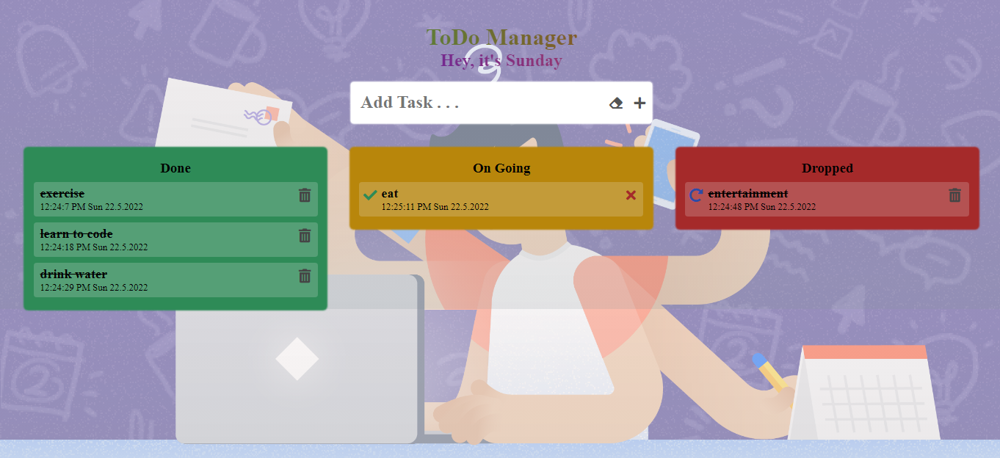

# Hosted link

# Getting Started with Create React App

This project was bootstrapped with [Create React App](https://github.com/facebook/create-react-app).

## Available Scripts

In the project directory, you can run:

### `npm start`

Runs the app in the development mode.\
Open [http://localhost:3000](http://localhost:3000) to view it in the browser.

The page will reload if you make edits.\
You will also see any lint errors in the console.

## Functionality

Current features:

- Add a new task to the ToDo list
- View all the tasks on the list
- Mark a task complete
- Delete a task from the list
- Recycle the task deleted from ongoing session
- Time and date marked when adding task
- currently storing data in browser using  local storage property
